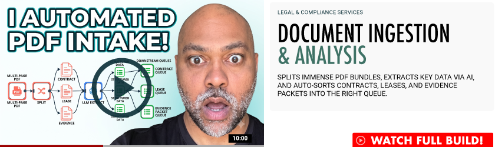

<a href="https://youtu.be/WPITVPNaPB0?si=4X_1kFoWvDbHoT4t" target="_blank">
  
</a>  

# Document Ingestion & Analysis
### Legal & Compliance Services
Splits immense PDF bundles, extracts key data via AI, and auto-sorts contracts, leases, and evidence packets into the right queue.  

**Live demo:** [doc-intake.elwoodberry.com](https://doc-intake.elwoodberry.com) · **Status:** `● INTERACTIVE PROTOTYPE`

Splits large PDF bundles, extracts key data via schema-validated LLM calls, and auto-routes contracts, leases, and evidence packets to the right downstream queue — with an audit record for every decision.

**Stack:** n8n (orchestration) · OpenAI API (extraction & classification) · Next.js on Vercel (demo page) · TypeScript

---

## Who this README is for

If you saw the demo and were sent here to figure out how it works: this document walks you through recreating it end to end. You'll stand up the demo page locally, build (or import) the n8n workflow, and connect the two. Budget roughly two hours, most of it in n8n.

It also explains *why* it's built this way, because the architecture decisions are the transferable part — the demo processes mock legal documents, but the pattern is domain-agnostic: any operation that receives big unstructured document bundles and files them by hand.

## The problem, in one paragraph

A team receives a 150+ page PDF containing dozens of individual documents — contracts, leases, correspondence, evidence. A person splits it, reads each document, decides what it is, and files it in the right place. The work is repetitive, the volume is unbounded, and the error mode (a misfiled document) is expensive. This pipeline replaces the splitting, reading, and filing — and keeps a human in the loop exactly where judgment is still required.

## Architecture

Two systems, two responsibilities. The web page is just the window; all automation logic lives in the workflow.

| Layer | Technology | Responsibility |
| --- | --- | --- |
| Presentation | Next.js on Vercel (static export) | Build page, upload UI, status + payload rendering |
| Orchestration | n8n | PDF splitting, schema-validated LLM extraction, classification, queue routing |
| Data | Storage of your choice (see step 2.1) | Split documents, extraction records, routing queues, audit log |
| AI | OpenAI API, schema-validated calls | Entity extraction and document classification — nothing else |

Data flow, in order:

1. Bundle uploaded via the demo page fires the intake request
2. n8n webhook receives the file reference and **opens an audit record first** — before any processing
3. The PDF bundle is split into individual documents
4. An LLM extracts entities from each document against a fixed JSON schema; non-conforming responses are rejected and retried
5. Each document is classified and routed to its downstream queue; low-confidence classifications route to a human review queue instead
6. The audit record is finalized and the structured result returns to the page

The design principle threaded through all six steps: **the model makes exactly two decisions** — what information is in a document, and what kind of document it is. Everything else (splitting, routing, logging, retries) is deterministic workflow. LLMs are components inside the pipeline, never the pipeline itself.

---

## Recreate it

### Prerequisites

- Node.js 18+
- An n8n instance — [n8n Cloud](https://n8n.io) trial or local via `npx n8n` (either works for this walkthrough; see the deployment note at the end for what changes in a regulated production environment)
- An OpenAI API key
- A multi-document PDF to test with. Use anything non-sensitive — a bundle of public SEC filings works well. **Do not use real client or claimant documents for evaluation.**

### Part 1 — Run the demo page locally (15 min)

```bash
git clone https://github.com/elwoodberry3/ias-build-002-doc-intake.git
cd ias-build-002-doc-intake
npm install
npm run dev   # http://localhost:3000
```

Everything on the page renders from one file: **`build.config.ts`** — identity, copy, the architecture table above, and the sample payloads. This repo is a clone of a shared template; the entire per-build surface is that single config file. Two governance behaviors worth noticing, because they're structural rather than procedural:

- Any config string still starting with `TODO:` renders on the page in a visible warning style. Unfinished content cannot ship silently.
- The live-demo section renders **only** when a real demo URL exists in the config. A mock-up cannot be presented as live.

### Part 2 — Build the n8n workflow (60–90 min)

If `/workflows` contains an export, import it (n8n → Workflows → Import from File), add your credentials, and skip to Part 3. To build it from scratch — which is the better evaluation exercise — the workflow is six stages:

**2.1 — Pick your storage.** The demo needs somewhere to put split documents and audit records. For a walkthrough, n8n's own data tables or a Google Drive folder are fine; for anything real, S3-compatible object storage plus a database. The pipeline doesn't care — storage is behind two swappable nodes.

**2.2 — Webhook intake + audit open.** Add a Webhook node (POST, header-auth enabled — never ship an unauthenticated webhook, even for a demo). Its first downstream action writes an audit record: timestamp, source, filename, a generated `audit_id`. Opening the audit trail *before* processing means even a failed run leaves evidence.

**2.3 — Split the bundle.** A Code node (or a PDF utility via HTTP) splits the inbound PDF into individual documents. Split on bookmarks/outline entries when present; fall back to a classifier pass on page ranges when not. Each split document is stored, and its reference fans out to the extraction stage — n8n handles the per-item iteration natively.

**2.4 — Schema-validated extraction.** One LLM call per document, with the response format pinned to a fixed JSON schema:

```json
{
  "doc_type": "contract | lease | evidence | correspondence | other",
  "parties": ["string"],
  "effective_date": "ISO-8601 or null",
  "monetary_amounts": [{ "value": "number", "context": "string" }],
  "key_terms": ["string"],
  "confidence": "number 0-1"
}
```

Validate every response against the schema in a Code node. Non-conforming output → reject and retry once with the validation error appended to the prompt; second failure → route to the review queue. This reject-and-retry loop is the single most important habit in the whole build: the model is never trusted to freestyle, and malformed output can never reach a downstream system.

**2.5 — Route on classification + confidence.** A Switch node routes each document by `doc_type` to its queue. Before the switch, an IF node checks `confidence` against a threshold (0.85 in the demo): below threshold, the document routes to `queue:human-review` regardless of type, with the model's own uncertainty logged as the reason. Automation handles the clear cases; people handle the judgment calls — that boundary is explicit, tunable, and audited.

**2.6 — Close the audit record, respond.** Final node updates the audit record with per-document outcomes and returns the structured result (the same shape shown in the demo page's payload section) to the webhook caller.

### Part 3 — Connect the two (15 min)

The demo page posts to the workflow through one environment variable:

```bash
# .env.local
N8N_WEBHOOK_URL=https://your-instance.app.n8n.cloud/webhook/doc-intake
N8N_WEBHOOK_TOKEN=your-header-token
```

Upload a test bundle from the page, then open the workflow's execution view in n8n — you'll see every stage, every model response, and the audit trail for the run. That execution view *is* the demo with the curtain pulled back.

### A note on Demo Mode

The public demo defaults to serving cached representative responses rather than firing live workflow executions for anonymous traffic. Two reasons, both boring and both real: public demos should never fail because of a rate limit or a cold model, and unmetered public endpoints burning workflow executions is bad operational hygiene. Live mode is enabled per session. The cached responses are real outputs of the real workflow — recorded, not written.

---

## What's mock and what's real

Stated plainly, because the distinction matters: the architecture, the workflow logic, the schema validation, the confidence gating, and the audit trail are real and reproducible from this README. The documents and every value in the sample payloads are mock — filenames, matter references (prefixed `MOCK-`), and metrics included. No client data, client names, or production outcomes appear anywhere in this repository.

## Adapting this to production

What changes between this demo and a production deployment in a regulated environment:

1. **Deployment target.** The demo workflow runs on n8n Cloud for convenience. The workflow export is portable — for production handling sensitive documents, deploy n8n self-hosted inside your own VPC so documents never transit third-party automation infrastructure. Same workflow, different host; that portability is deliberate.
2. **Storage and retention.** Object storage with encryption at rest, a real database for audit records, and retention policies matching your compliance requirements replace the demo's lightweight storage.
3. **The schema and queues become yours.** The extraction schema, document types, and routing destinations in 2.4–2.5 are the demo's; production replaces them with your document taxonomy and your systems of record. The pipeline shape doesn't change.
4. **Threshold tuning with an eval set.** Before go-live, run a labeled set of representative bundles through the pipeline and tune the confidence threshold against your actual tolerance for auto-filing versus human review. Ship the eval set with the system — it's how you'll know a model upgrade helped rather than hurt.

## Questions

If you've read this far, you're probably evaluating whether this pattern fits an operation you run. The fastest way to find out is a working conversation, not a pitch: [elwoodberry.com/contact](https://elwoodberry.com/contact). The rest of the portfolio — eighteen more builds on the same architecture discipline — is at [elwoodberry.com](https://www.elwoodberry.com).

---

*License: portfolio-demonstrative code, all rights reserved — see `LICENSE.md`. Production and licensed versions are maintained privately.*

